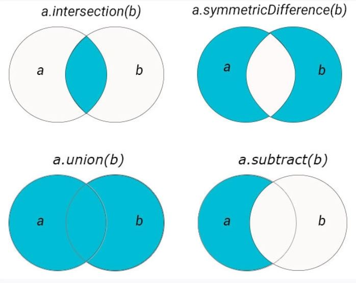
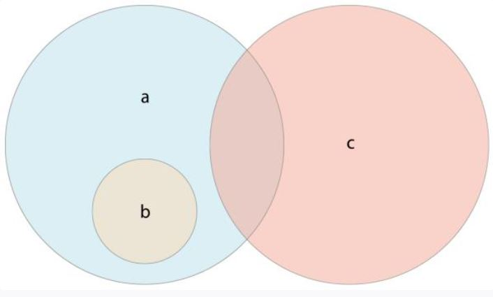

# Swift 4 :bird:

**--- Para entender este repositorio recomiendo tener conocimientos basicos de programacion y POO ---** 

Es un lenguaje que combina lo mejor de C y Objective-C, haciendo que sea mucho mas claro. Funciona bien en conjunto con Objective C y se usa para el desarrollo para iOS o OSX. 

* El uso de punto y coma es completamente opcional

## Set Operations

* `Interseccion`: Crea un nuevo set con los valores en común entre ambos sets
* `symmetricDifference`: Se crea un nuevo set con los items que NO tienen en comun ambos sets
* `union`: Se crea un set con todos los valores de ambos sets
* `subtracting`: Se crea un nuevo ser con valores que no estan en el set especificado

* A es el `superset` de B, ya que contiene todos los elementos que tiene B. 
* B es el `subset` de A, ya que A tiene todos sus elementos
* B y C estan `disjointed` ya que no comparten elementos en común

En base a estas relaciones podemos hacer las siguientes consultas:

* `is equal (==)` : Si contienen los mismos valores
* `isSubset(of)` : Si todos los valores de cierto set estan en otro set. (Soy subset de este otro set?)
* `isSuperset(of:)` : Si todos los valores de mi set estan en otro set (Soy el superset de este set?)
* `isStrictSubset(of:)` o `sStrictSuperset(of:)` : Si un set es superset o subset de otro set, pero no igual a este.
* `isDisjoint(with:)` : Mi set tiene ningun item en comun con este otro set? 
